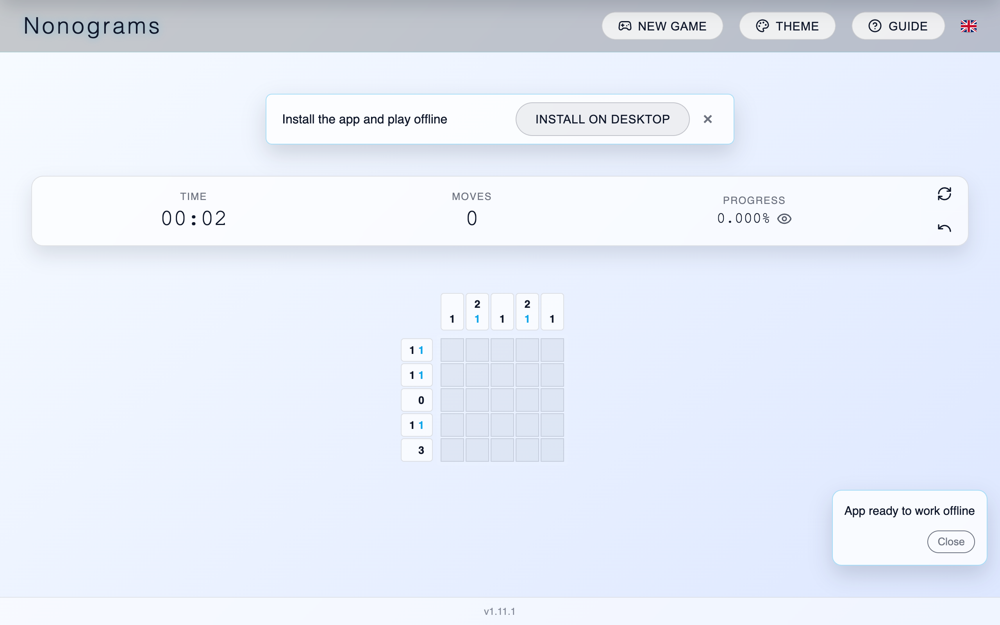

# Nonograms

## Description

Nonograms is a modern, fast, and accessible logic puzzle game (also known as Picross or Griddlers). Solve pixel-art puzzles by marking cells according to numeric clues for rows and columns. The app features:
- Clean UX with keyboard and touch support
- Multiple languages and PWA support (installable on desktop and mobile)
- Difficulty simulation and guide to learn solving strategies
- Shareable puzzles and persistent progress

Play online at https://nonograms.7u.pl or install as a PWA for an app-like experience.
